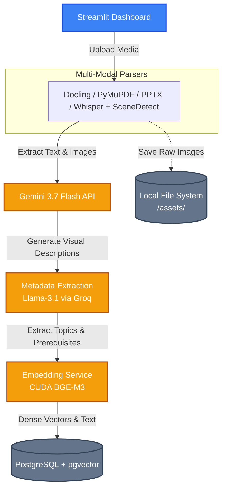
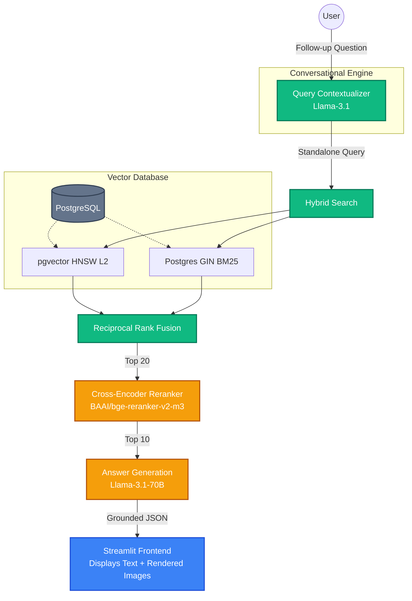
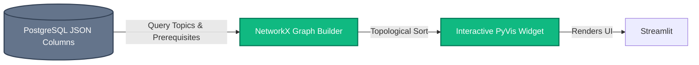

# 🏛️ System Architecture

This document maps out the high-performance, GPU-accelerated Multimodal RAG architecture.

## 📥 1. Ingestion & Indexing Pipeline

## 🔍 2. Advanced Retrieval & Generation (Tutor Chat)

## 🕸️ 3. True Knowledge Graph Construction

## 🛠️ Technology Stack
*   **Frontend**: Streamlit, PyVis (HTML Components)
*   **Database**: PostgreSQL, pgvector (HNSW, GIN)
*   **Vector Embeddings**: `BAAI/bge-m3` (Local, CUDA Accelerated)
*   **Cross-Encoder**: `BAAI/bge-reranker-v2-m3` (Local, CUDA Accelerated)
*   **Vision Language Model (VLM)**: Gemini 3.7 Flash API (Cascading Fallbacks)
*   **Large Language Model (LLM)**: Llama-3.1-70B-Versatile via Groq LPU
*   **Video Processing**: yt-dlp, faster-whisper, PyAV, scenedetect
*   **Document Parsing**: Docling, PyMuPDF, python-pptx
